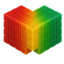

# Entropy Medical Image Viewer

[](https://github.com/adlerdh/entropy/actions/workflows/macos.yml)
[](https://github.com/adlerdh/entropy/actions/workflows/windows.yml)
[](https://github.com/adlerdh/entropy/actions/workflows/ubuntu.yml)
[](https://github.com/adlerdh/entropy/actions/workflows/release.yml)
[](https://github.com/adlerdh/entropy/releases)
[](https://github.com/adlerdh/entropy/actions/workflows/clang-tidy.yml)
[](LICENSE.txt)
[](https://en.cppreference.com/w/cpp/23)



Entropy is a cross-platform tool for visualizing, comparing, registering, segmenting, annotating, and inspecting medical
images.

It is built to handle projects with multiple images in a common reference space. It can load any number of images,
arrange them in flexible layouts, render them with shader-based MPR views, and display their values, coordinates, and
transforms. Different rendering modes help with comparing images and evaluating spatial alignment.

Entropy is primarily developed and maintained by Daniel H. Adler, Ph.D., with support from Professor [James C. Gee, Ph.D.](https://www.med.upenn.edu/apps/faculty/index.php/g275/p10656)

Copyright 2021-2026 Daniel H. Adler, Ph.D. and the Penn Image Computing and Science Lab (PICSL), University of
Pennsylvania. All rights reserved.

## Building

Entropy uses CMake and C++23. Build the pinned third-party libraries first, then configure and build Entropy against
them following the "superbuild" pattern:

```sh
BUILD_TYPE=release # or debug

# Dependencies
cmake --preset deps-${BUILD_TYPE}
cmake --build --preset deps-${BUILD_TYPE} --parallel

# Application
cmake --preset app-${BUILD_TYPE}
cmake --build --preset app-${BUILD_TYPE} --parallel

# Unit tests
ctest --test-dir build-${BUILD_TYPE} --parallel 8 --output-on-failure
```

Adjust the parallel job count for your machine, lowering it if you run out of memory. Run with:

```sh
build-${BUILD_TYPE}/bin/entropy # macOS and Linux
.\build-${BUILD_TYPE}\bin\entropy.exe # Windows
```

Release packages are generated with preset `package-release` for:

- macOS Apple Silicon, arm64
- macOS Intel, x86_64
- Windows, x86_64
- Ubuntu Linux, x86_64
- Fedora Linux, x86_64

See [BUILDING.md](BUILDING.md) for detailed platform and build requirements, compiler versions, Linux development
packages, build options, tests, and coverage instructions. Packaging commands and artifact layouts are detailed in
[PACKAGING.md](PACKAGING.md).

## Overview

Entropy is useful for reviewing multiple images in relation to one another in a common reference space. It handles
multimodal scalar and multi-component images in 2D, 3D, and 4D (time series), as well as segmentations, vector
annotations, and registration transformations (affine matrices and deformation fields).

### Image Visualization and Comparison

Entropy is designed for crisp, responsive rendering. It uses GPU 3D texturing and preserves native voxel component types
instead of casting to a fixed display type. A project contains a reference image that defines the common coordinate
space, plus any number of additional images.

- Flexible layouts with per-view image visibility
  - Axial, coronal, sagittal, and oblique multi-planar reconstruction (MPR)
  - Minimum, mean, and maximum intensity projections and X-ray simulation
  - Tiled lightbox views
  - Rotatable crosshairs
  - 3D rendering of image isosurfaces
- Rendering modes
  - Layered images with opacity blending
  - Horizontal and vertical swiping comparison
  - Flashlight and checkerboard comparison
  - Visual metrics: difference, overlap, local normalized cross-correlation (NCC), and local linear residual
- Image adjustments
  - Window width and level
  - Layer opacity
  - Color maps, continuous and discrete
  - Image edge filtering
  - Nearest neighbor, linear, and cubic B-spline interpolation
- Precise image interrogation
  - Voxel intensities and percentiles
  - Spatial coordinates, including after transformation
  - Iso-contouring
- View and crosshairs synchronization
  - Across linked views and layouts
  - With other Entropy sessions or [ITK-SNAP](https://www.itksnap.org/)

### Transformations and Warps

Entropy has advanced support for image transformations:

- Affine transformations (from voxel to physical space) from image headers
- Import additional affine transformations
- Manual translation, rotation, and scaling
- Load inverse and forward deformable warp fields computed from external registration tools
  - Interactively apply warps to images
- Vector field visualization
  - Vector field arrows and warped grid lines
  - Compute maps of field magnitude, Jacobian determinant, Laplacian, divergence, and curl
  - Compute matching inverse or forward warp fields for loaded deformation fields

### Registration Backends

Entropy does not implement its own full registration engine. Instead, it can launch external registration tools, monitor
them, and import their results into the project where the images are already loaded. Current registration backends are:

- [ANTs](https://github.com/ANTsX/ANTs)
- [FireANTs](https://fireants.readthedocs.io/en/latest/)
- [Greedy](https://greedy.readthedocs.io/en/latest/)

The Image Registration workflow lets users select fixed and moving images, choose parameters for each backend, inspect
the command preview, monitor progress and logs, and import generated outputs. Imported outputs can include transformed
moving images, affine matrices, inverse warp fields, and forward warp fields. Backend executables are configured in
Application Settings.

### Segmentation, Annotations, and Landmarks

The same views used for image comparison can be used to paint segmentation overlays, draw vector-based annotations, and
place point landmarks:

- Save, clear, remove, and inspect segmentation layers
  - Multiple segmentations per image
  - Filled or outline rendering
- Paint segmentations with foreground and background labels
  - Adjust brush shape (2D/3D, round/square) and behavior
- Draw vector-based annotations, including on oblique planes
  - Fill annotations to create segmentations
- Create and save groups of point landmarks in physical or voxel coordinates

## Supported Formats

Entropy uses [ITK](https://itk.org/) for image I/O of these common medical image formats:

- [Neuroimaging Informatics Technology Initiative (NIfTI)](https://nifti.nimh.nih.gov/nifti-1/) and Analyze header/image pairs (`.nii`, `.nii.gz`, `.hdr`, `.img`)
- [Nearly Raw Raster Data (NRRD)](https://teem.sourceforge.net/nrrd/format.html) (`.nrrd`, `.nhdr`)
- [MetaImage](https://insightsoftwareconsortium.github.io/ITKWikiArchive/Wiki/ITK/MetaIO/Documentation/) (`.mha`, `.mhd`, with companion raw data `.raw`, `.zraw`, or `.raw.gz`)
- [DICOM](https://www.dicomstandard.org/current/) via [GDCM](https://gdcm.sourceforge.net/) (`.dcm` and DICOM series)
- Standard 2D image formats: JPEG (`.jpg`, `.jpeg`), PNG (`.png`), TIFF (`.tif`, `.tiff`), and BMP (`.bmp`, `.dib`)

Entropy also displays complete image header information, DICOM metadata, and editable spatial geometry for standard 2D
raster images that do not carry medical image headers. It loads the supporting files needed to make a review complete:
segmentations, landmarks, annotations, affine transforms, deformation warp fields, layouts, and project files.

### Multi-Component and Time Series Images

Entropy supports 2D, 3D, and 4D (time series) images with any number of components per pixel/voxel.

Component types:
- Integer (signed/unsigned 8, 16, and 32 bits)
- Floating-point (32 and 64 bits)

Pixel/voxel types:
- Scalar
- Complex
- RGB and RGBA
- Vector fields (e.g. representing deformable registration warps)
- General multi-component images

Images with multiple components can be viewed by individual component, magnitude, RGB/RGBA color, and as various derived
maps (divergence, curl, and Jacobian determinant). Time series images can be reviewed with per-image and global time
controls.

## Technical Notes

Entropy is a native C++ application built for interactive desktop performance across multiple platforms. Third-party
dependencies are pinned from source.

|  |  |
| --- | --- |
| Platforms | macOS, Windows, Ubuntu, and Fedora |
| Language | C++23 |
| Build system | CMake presets with separate dependency and app stages |
| Toolchains | Apple Clang, MSVC/Visual Studio, and GCC in CI |
| Tests | Unit tests and coverage reports run with GitHub Actions |
| Rendering | OpenGL 3.3 Core with GLSL shaders |
| Image I/O | Medical image loading through [ITK](https://itk.org/) and [GDCM](https://gdcm.sourceforge.net/) |
| UI | [Dear ImGui](https://github.com/ocornut/imgui) with [Docking support](https://github.com/ocornut/imgui/wiki/Docking) and native platform menus and dialog integration |

Entropy targets OpenGL 3.3 Core with GLSL 3.30 shaders to maximize compatibility across platforms and operating systems.
Detailed compiler versions, operating system versions, development packages, and coverage workflows are documented in
[BUILDING.md](BUILDING.md).

### Continuous Integration

GitHub Actions builds and tests Entropy on macOS, Windows, Ubuntu, and Fedora. Current CI coverage includes macOS
14.6.1, 15.3.1, 15.6.1, and 26.0.1; Windows 10 and 11; Ubuntu 22.04 and 24.04; and Fedora 43. The CI toolchains are
Apple Clang 15.0.0+, MSVC/Visual Studio 2022 17.3.4+, and GCC 13.3.0+.

## Core Concepts

### Reference Image

The reference image defines the main project space. Additional images are compared against it and may have affine
transformations or deformable warps that relate them to the reference and each other.

### Active Image

The active image is the image currently targeted by many editing, inspection, transformation, and menu actions.

### Image Geometry and Affine Transformations

Entropy separates image geometry from affine transformations loaded or edited by the user:

1. The image header defines the image's native voxel to subject geometry
2. The initial/imported affine transformation is used for a loaded alignment or an alignment computed by registration
3. The manual affine transformation is intended for interactive adjustment

For standard 2D raster images such as JPEG, PNG, TIFF, and BMP, Entropy asks for spacing, origin, and direction
information when the image is loaded and saves that geometry in the project file.

This separation makes it possible to inspect and revise alignment without losing the original image geometry.

### Deformable Warp Fields

Entropy uses inverse warp fields for image sampling and forward warp fields for moving spatial objects, such as
landmarks and annotations. A project with one image can still apply a warp to that image, treating the image as its own
reference space.

### Application Settings and Project Settings

Application settings store personal UI preferences and backend configuration. Project settings store presentation and
review state that is packaged with a project, such as layouts, comparison settings, raycasting settings, segmentation
display defaults, and transformation assignments.

## Quick Start

One typical workflow is to load a reference image and other images to compare against it:

1. Open one or more images from the menus (*File -> Open Image(s) / Project / DICOM Series*), the opening screen, or
   the command line. Multiple images will be loaded in a list that appears across all window panels (menu:
   *Window -> Images / Segmentations / Registration / Landmarks, Annotations / Isosurfaces*).
2. By convention, the first image (number 0) is the **Reference** image. It defines the reference/common coordinate
   space in which all images are displayed. Any other image can be designated as Reference (menu:
   *Image -> Set as Reference*).
3. By default, the last image in the list is the **Active** image. View and transformation interactions are applied to
   the Active image using the mouse and keyboard controls. Set the Active image using menu *Image -> Select Active
   Image*, the drop-down list in the Images panel, or the [keyboard shortcuts](#keyboard-shortcuts).
4. Choose a layout and view types for the review or analysis task.
5. Use image visibility, opacity, comparison modes, and the opacity mixer to compare images.
6. Use the voxel inspector to verify coordinates and sampled values.
7. Add segmentations, annotations, landmarks, affine transformations, or warp fields as needed.
8. Save the work as an Entropy JSON project file. This file will persist all project images, properties, and settings.

### Command Line

The command line accepts image, DICOM, and project inputs:

| Option | Meaning |
| --- | --- |
| `--image`, `-i` | Image path, repeat for multiple images |
| `--seg`, `-s` | Segmentation path(s) for the preceding image |
| `--dicom`, `-d` | DICOM folder or file to scan |
| `--project`, `-p` | Entropy project JSON file, mutually exclusive with `--image`, `--seg`, and `--dicom` |
| `--layouts` | View layouts specification JSON file |
| `--log-level`, `-l` | Console log level |

Examples:
```sh
entropy -i ref.nii.gz -s ref_seg.nii.gz -i moving.nii.gz
entropy -p project.json
```

Image inputs, DICOM inputs, and `--project` are mutually exclusive. Use `entropy --help` for the complete command-line
reference.

### Project Files

Entropy project files preserve all state needed to reopen a review. They include a reference image, additional images,
segmentations, landmarks, annotations, transformations, layouts, and presentation settings. Minimal example:

```json
{
  "reference": {
    "path": "reference_image.nii.gz"
  },
  "additional": [
    {
      "path": "moving_image_1.nii.gz"
    },
    {
      "path": "moving_image_2.nii.gz"
    }
  ]
}
```

Including segmentations, landmarks, annotations, and an affine transformation:

```json
{
  "version": 1,
  "reference": {
    "path": "reference_image.nii.gz",
    "segmentations": [
      {
        "path": "reference_seg.nii.gz"
      }
    ],
    "landmarks": [
      {
        "name": "Reference landmarks",
        "inVoxelSpace": false,
        "points": [
          {
            "index": 1,
            "position": [12.0, 24.0, 36.0],
            "name": "AC"
          }
        ]
      }
    ],
    "annotationsPath": "reference_annotations.json"
  },
  "additional": [
    {
      "path": "moving_image.nii.gz",
      "initialAffine": {
        "path": "moving_image_affine.txt"
      },
      "segmentations": [
        {
          "path": "moving_image_seg.nii.gz"
        }
      ],
      "landmarks": [
        {
          "path": "moving_image_landmarks.csv",
          "inVoxelSpace": false
        }
      ],
      "annotationsPath": "moving_image_annotations.json"
    }
  ]
}
```

> The project format may evolve as Entropy develops.

### Keyboard Shortcuts

The complete list is available under menu *Help > Keyboard Shortcuts*.

| Shortcut | Action |
| --- | --- |
| `V` | Pointer (crosshairs) mode |
| `L` | Window width/level adjustment mode |
| `Z` | Zoom mode |
| `P` | Pan mode |
| `B` | Segmentation brush mode |
| `R` | Active image rotation mode |
| `T` | Active image translation mode |
| `Y` | Active image scaling mode |
| `Left` / `Right` / `Down` / `Up` | Move crosshairs |
| `Page Down` / `Page Up` | Previous/next slice |
| `[` / `]` | Previous/next view layout |
| `Shift + [` / `Shift + ]` | Set previous/next image as active |
| `W` | Toggle active image visibility |
| `Q` / `E` | Reduce/increase active image opacity |
| `S` | Toggle active segmentation visibility |
| `A` / `D` | Reduce/increase active segmentation opacity |
| `C` | Recenter views on crosshairs |
| `Shift + C` | Reset view orientation, zoom, and centering |
| `X` | Toggle crosshairs visibility |
| `U` | Toggle user interface |
| `I` | Toggle voxel inspector |
| `O` | Cycle view overlays |

## Runtime Files

Entropy writes a small number of user-level runtime files outside of project files

### Settings

Entropy persists application settings in the standard location for each platform:

- macOS: `~/Library/Application Support/Entropy/settings.json`
- Windows: `%APPDATA%\Entropy\settings.json`
- Linux: `${XDG_CONFIG_HOME:-~/.config}/entropy/settings.json`

Settings owned by a project are saved in project JSON files instead of the application settings file.

### Logging

Entropy writes logs to the console and to daily log files. Log verbosity can be changed from Application Settings or
with `--log-level`. Default log locations:

- macOS: `~/Library/Logs/Entropy/`
- Windows: `%APPDATA%\Entropy\Logs\`
- Linux: `${XDG_STATE_HOME:-~/.local/state}/entropy/logs/`

## License

Entropy source code and official release packages are distributed under the Apache License 2.0
([LICENSE.txt](LICENSE.txt)). Required project notices are in [NOTICE.txt](NOTICE.txt). Third-party dependency notices
are in [THIRD_PARTY_NOTICES.md](THIRD_PARTY_NOTICES.md).
